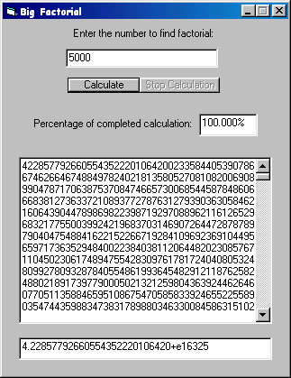



## Find enormous factorials\-super update\-now supports more than 20,000,000

### Description

This is the super update of the previous submission. This program can

now calculate the factorial of more than 20000000. I have not tested the factorial of this number, I cannot spend hours to find the result.

But this program can actually find the factorial of numbers may be larger than this. This code is really amazing. I have tested the factorial of 100000. The result is 2.82422940796034787e+456573. It also asks you to save the whole result in a file. And if you are really interested in math, then you must check it out. The code is very well commented. Read the comments carefully. You will know many things. Please, vote for me. Thanks.
 
### More Info
 

             |
---                |---
**Submitted On**   |2002-07-19 00:21:48
**By**             |[Isbat Sakib](https://github.com/Planet-Source-Code/PSCIndex/blob/master/ByAuthor/isbat-sakib.md)
**Level**          |Advanced
**User Rating**    |4.8 (29 globes from 6 users)
**Compatibility**  |VB 5\.0, VB 6\.0
**Category**       |[Math/ Dates](https://github.com/Planet-Source-Code/PSCIndex/blob/master/ByCategory/math-dates__1-37.md)
**World**          |[Visual Basic](https://github.com/Planet-Source-Code/PSCIndex/blob/master/ByWorld/visual-basic.md)
**Archive File**   |[Find\_enorm1077907182002\.zip](https://github.com/Planet-Source-Code/isbat-sakib-find-enormous-factorials-super-update-now-supports-more-than-20-000-000__1-37034/archive/master.zip)

